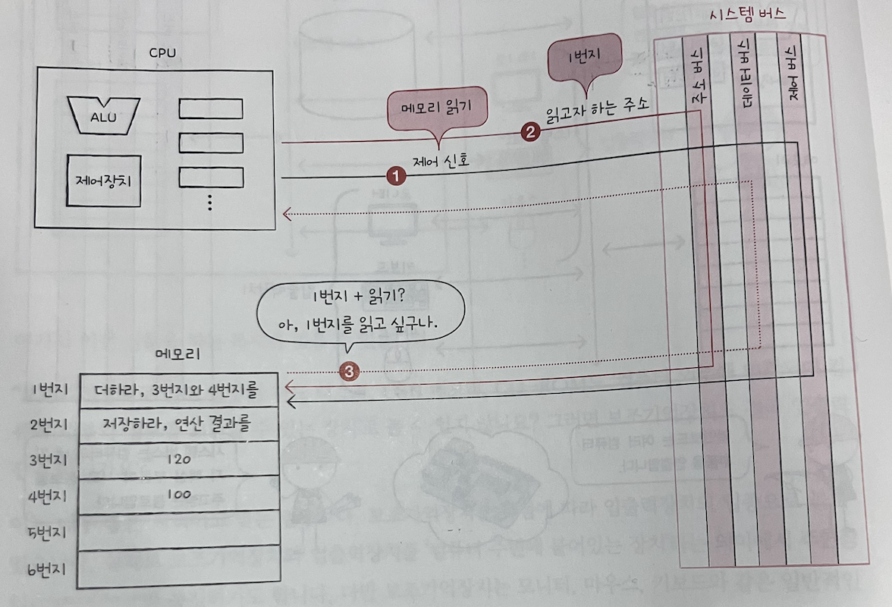
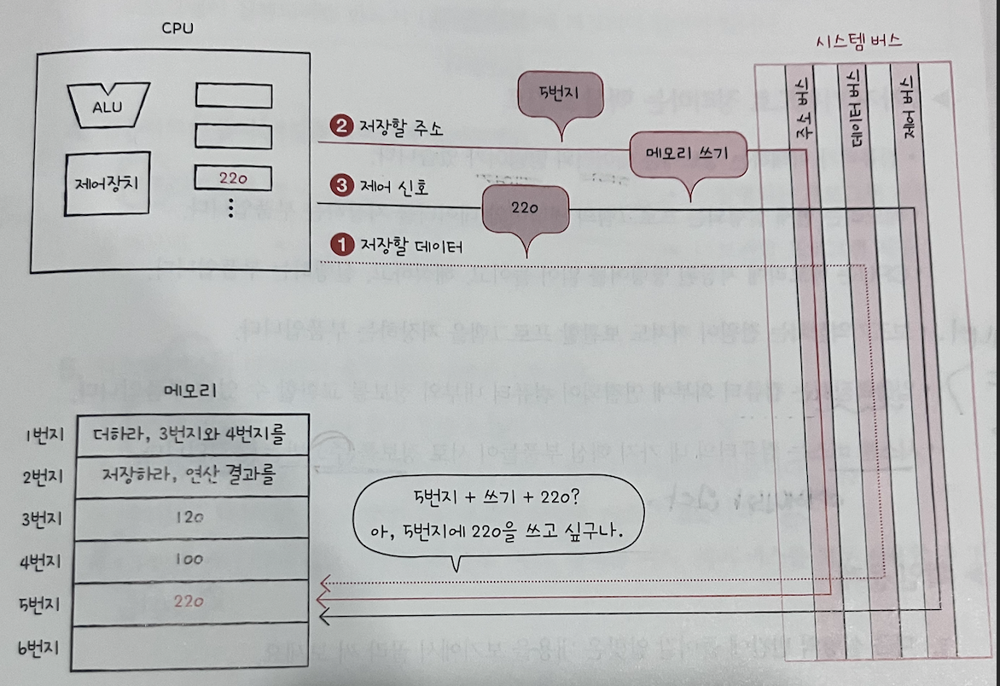

# 01-1 컴퓨터 구조를 알아야 하는 이유

* ### 문제해결에 도움됩니다.
    * 컴퓨터 구조를 잘 알고있다면 컴퓨터를 미지의 대상이 아닌 <ins>분석의 대상</ins> 으로 바라볼 수 있다.
* ### 코드 문법만으로 알기어려운 성능, 용량, 비용을 고려한 개발을 할 수 있습니다.
    * 무작정 최신컴퓨터를 고른다? -> 수백, 수천만원 까지 비용이 늘어날 수 있다. 상황에 맞는 적절한 컴퓨터를 고르는 것은 중요!
    * 클라우드도 마찬가지! 클라우드의 컴퓨터 사양을 어떻게 맞출 것인지는 개발자의 몫이다.
    * 매일 새로운 글이 100개씩, 새로운 글이 1000개씩 생성되고 있다. 어떤 <ins>저장장치</ins> 를 선택해야하며, 어느정도 용량을 갖춰야 할지는 개발자가 판단할 수 있어야한다.

# 01-2 컴퓨터 구조의 큰 크림

컴퓨터 구조는 크게 두 부분으로 나뉘어져있음

컴퓨터 구조를 이해하는 핵심적인 두 가지
```mermaid
  graph TD;
      컴퓨터구조-->컴퓨터가이해하는정보;
      컴퓨터구조-->컴퓨터의네가지핵심부품;
```

### 컼퓨터가 이해하는 정보

컴퓨터는 0과 1로 표현된 정보만을 이해한다. 0과 1로 구성된 데이터는 크게 데이터와 명령어로 구성될 수 있다.
즉, 컴퓨터는 0과 1로 표현된 명령어와 데이터만을 이해할 수 있다.

```mermaid
  graph TD;
      컴퓨터구조-->컴퓨터가이해하는정보;
      컴퓨터구조-->컴퓨터의네가지핵심부품;
      컴퓨터가이해하는정보-->데이터;
      컴퓨터가이해하는정보-->명령어;
```
데이터(data) : 컴퓨터가 이해하는 숫자, 문자, 이미지, 동영상과 같은 정적인 정보

명령어(instruction) : 데이터를 움직이고 <ins>컴퓨터를 작동시키는 정보</ins>

데이터도 중요하지만 그 보다 중요한 것은 명령어이다. 명령어가 없으면 데이터는 아무것도 할 수 없는 정보 덩어리일 뿐
명령어들은 CPU 마다 조금씩 다를 수 있지만 기본적으로 이미 탑재되어있다.

### 컴퓨터의 4가지 핵심 부품

* 중앙처리장치(CPU)
* 주기억장치(main memory)
* 보조기억장치(secondary storage)
* 입출력장치(i/o device)

```mermaid
  graph TD;
      컴퓨터구조-->컴퓨터가이해하는정보;
      컴퓨터구조-->컴퓨터의네가지핵심부품;
      컴퓨터가이해하는정보-->데이터;
      컴퓨터가이해하는정보-->명령어;
      컴퓨터의네가지핵심부품-->중앙처리장치;
      컴퓨터의네가지핵심부품-->주기억장치;
      컴퓨터의네가지핵심부품-->보조기억장치;
      컴퓨터의네가지핵심부품-->입출력장치;
```

### 메모리(여기서는 메인메모리)
* 컴퓨터가 이해하는 정보는 명령어와 데이터이다. 이때 메모리는 <ins>현재 실행되는 프로그램</ins>의 명령어와 데이터를 저장하는 부품(즉, 모든 프로그램의 명령어와 데이터가 메모리에 올라와 있지 않다.)
    * 프로그램이 실행되기 위해서는 <ins>반.드.시</ins> 메모리에 저장되어 있어야한다.
* 주소 : CPU 가 메모리에 저장된 명령어와 데이터를 효율적으로 접근하기 위한 위치정보(말 그대로 주소=address)

|         메모리          | 주소  |
|:--------------------:|:---:|
| 더하라, 3번지와 4번지를 (명령어) | 1번지 |
|  저장하라, 연산결과를 (명령어)   | 2번지 |
|      120 (데이터)       | 3번지 |
|      100 (데이터)       | 4번지 |
|                      | 5번지 |
|                      | 6번지 |

### 중앙처리장치(CPU)
* <ins>컴퓨터의 두뇌</ins>
* 메모리에 저장된 명령어를 <ins>읽어드리고</ins> 읽어드린 명령어를 <ins>해석</ins> 하고 <ins>실행</ins> 하는 부품

CPU 의 역할과 작동원리를 구체적으로 이해하기 위해서는 CPU 를 구성하고 있는 3가지 요소를 기억할 것!
```mermaid
  graph TD;
      CPU-->산술논리연산장치(ALU:Arithmetic Logic Unit);
      CPU-->레지스터(register);
      CPU-->제어장치(CU: Control Unit;
```

* ALU : 쉽게 말해 계산기, 대부분의 계산은 ALU 가 한다.
* 레지스터 : CPU 내부의 작은 임시 저장 장치. 프로그램을 실행하는 데 필요한 값들을 임시로 저장한다. 여러가지 레지스터가 존재하고, 각기 다른 이름과 역할을 가지고 있음
* 제어장치 : 제어신호(control signal) 라는 전기신호를 내보내고 명령어를 해석하는 장치, 제어신호란 컴퓨터 부품들을 관리하고 작동시키기 위한 일종의 전기 신호.
    * CPU가 메모리에 저장된 값을 읽고 싶을 땐 메모리를 향해 <ins>**메모리 읽기**</ins> 라는 제어 신호를 보낸다.
    * CPU가 메모리에 어떤 값을 저장하고 싶은 때 메모리를 향해 <ins>**메모리 쓰기**</ins> 라는 제어 신호를 보낸다.

### 보조기억장치
메모리는 실행되는 프로그램의 명령어와 데이터를 저장하는 장치이지만 큰 단점이 존재한다.
1. 가격이 너무 비싸다
2. 전원이 꺼지면 저장된 내용을 잃는다.
   그래서 이런 단점을 극복하고자 나온 것이 보조기억장치
* 메모리보다 가격이 저렴하면서도 전원이 꺼져도 저장된 내용을 저장하고 있는 장치

예시 : HHD, SSD, USB 메모리, CD-ROM

|        | 메모리          | 보조기억장치     |
|--------|--------------|------------|
| 가격     | 비쌈           | 상대적으로 저렴   |
| 데이터 영속 | 전원꺼지면 데이터 잃음 | 전원이 꺼져도 저장 |

### 입출력장치
* 마이크, 스피커, 프린터, 마우스, 키보드와 같이 컵퓨터 외부에 연결되어 컴퓨터 내부와 정보를 교환하는 장치

### 메인보드와 시스템버스
메인보드는 여러 컴퓨터 부품들을 연결함.
부품들끼리 정보를 주고 받을 수 있는 데 이는 버스(bus) 라고 하는 통로가 있기 때문이다.
이때 여러가지 버스(bus), 즉 통로가 존재하는 데 컴퓨터의 4가지 핵심 부품을 연결하는 가장 중요한 버스는 시스템버스(system bus)이다.

```mermaid
  graph TD;
      시스템버스(system bus)-->주소 버스;
      시스템버스(system bus)-->데이터 버스;
      시스템버스(system bus)-->제어 버스;
```

각기 다른 버스를 통해 정보를 교환한다 (생각해보면 하나의 버스에 여러개의 정보가 섞이면 곤란할 듯 하다, 어디로 가야할 지 구분도 해줘야하고..)

